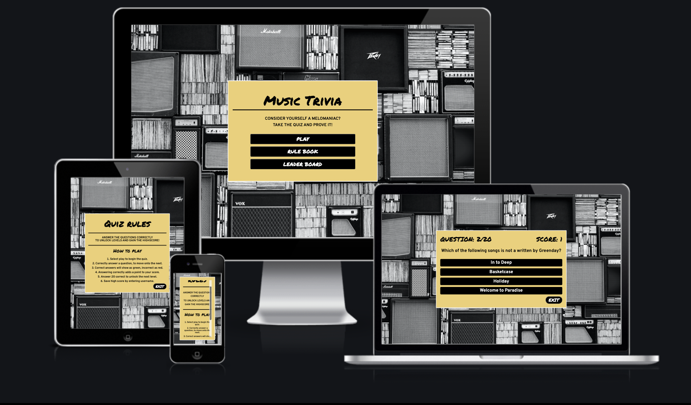
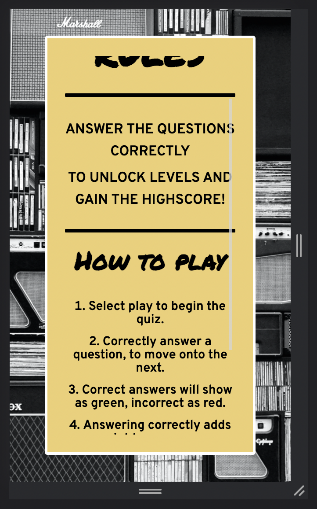
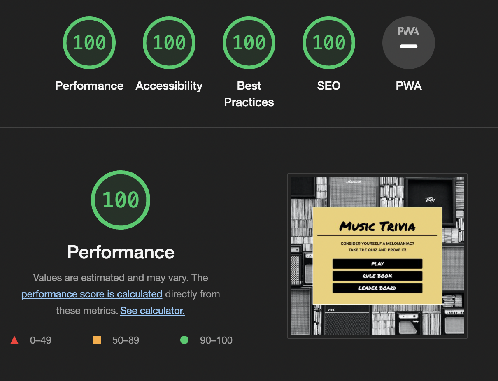

# Music Triva

[View the live project here](https://ejdiamond.github.io/Music-Trivia/)

## User Experience (UX)

### User stories

**First Time Visitor Goals**

- As a First Time Visitor, I want to be aesthetically pleased and quickly understand the purpose of the site.
- As a First Time Visitor, I want to be able to easily find the rules of the quiz and understand how to play.
- As a First Time Visitor, I want to be get on with answering the quiz questions.
- As a First Time Visitor, I want to see the question number and my score as I progress through the quiz.

**Returning Visitor Goals**

- As a Returning Visitor, I want to have highscores logged to see progression.

**Frequent User Goals**

- As a Frequent User, I want to check my highscores.
- As a Frequent User, I want to be able to clear highscores so more can be entered.

## Design

### Colour Scheme

The main colours used are yellow (#eecf71), black and white, these colours compliment each other well, producing a clean, bold design.

### Typography

The Permanent Marker and Overpass fonts are the main fonts used throughout the whole website. Cursive is the fallback for Permanent Marker, and sans serif for Overpass, in case for any reason the font isn't being imported into the site correctly. Permanent Marker is a bold and playful font suited well for a game/ quiz, Overpass is a simple but attractive font making it perfect for a question and answer format.

### Imagery

- The background image used throught the quiz is a photograph of a speaker wall, which fits the theme of the quiz and makes for an interesting background.
- The [favicon](https://github.com/EJDiamond/Music-Trivia/blob/main/assets/images/favicon.png), matches the theme of the page, using the yellow background with a musical note representing the music trivia. 

### Wireframe

The [wireframes](https://github.com/EJDiamond/Music-Trivia/blob/main/assets/images/wireframe-music-trivia.png) show the intial page where the user can select to play, read rules or view the leaderboard. Once 'play' is selected the player then has the option to select a level, intially only the first level is unlocked and once passed, level two will be available, with level three being accessed once the second level is passed.

The quiz is opened once the level is selected, taking the user to the first question. When an answer is hovered over the slection turns white, if the answer selected is correct it will turn green, if incorrect, it will turn red.

The option to exit the quiz is presented as a button at each stage.

The wireframe was created in Adobe Illustrator, using one artboard to display the seperate modals throughout the quiz. The same fonts were downloaded to the Adobe library and the background image from pexels to get a real feel as to what the quiz would look like.

# Frameworks, Libraries and Programmes Used

- [Google Fonts](https://fonts.google.com/)
   - Used to import Permanent Marker and Overpass fonts into the css style sheet and used throughout the site.

- [Github](https://github.com/)
   - Used to save project code from Git.

- [Adobe Illustrator](https://www.adobe.com/)
   - Used to create 
      - favicon
      - wireframes

# Testing

## Homepage

   - The three buttons on the homepage all link to the relevant containers, so the correct section of the page pops up when button click is performed.

## Buttons

   - All exit buttons return to the homepage.
   - The save button saves the users name and highscores to the local storage which then display in the leaderboard.
   - The clear button on the leaderboard effectively clears the local storage.

## Responsiveness

   - When the user is viewing on different size screens the content changes dependent on the screen.
   - Screen sizes 646px width and below the font sizes are decreased for a better user experience.
   - Screen sizes 474 px width and below, the rule book uses a scroll bar so the user can scroll the rules without the font size being too small.
   - The flex containers mean the height and width of the modal box are decreased automatically on smaller devices.
   - The form and buttons on the end of quiz container are displayed in a column to suit smaller devices.

   

## Validator Testing

- HTML
   - No errors were shown when passed through the HTML [W3C Validator](https://validator.w3.org/nu/?doc=https%3A%2F%2Fejdiamond.github.io%2FMusic-Trivia%2F)

- CSS
   - No errors were shown when passed through the [CSS Validator](https://jigsaw.w3.org/css-validator/validator?uri=https%3A%2F%2Fejdiamond.github.io%2FMusic-Trivia%2F&profile=css3svg&usermedium=all&warning=1&vextwarning=&lang=en)

- Javascript
   - No errors were shown when passed through [JSHint](https://github.com/EJDiamond/Music-Trivia/blob/main/assets/images/jshint-results.png)

- Chromes Lighthouse
   - 

## Testing User Stories From User Experience Section

- __First Time Visitor Goals__

   - a) As a First Time Visitor, I want to be aesthetically pleased and quickly understand the purpose of the site.
      - The homepage of the site is simplistic and easy to navigate meaning you can start playing the game quickly.
      - The user can quickly selected different buttons and navigate to the different elements of the page.

   - b) As a First Time Visitor, I want to be able to easily find the rules of the quiz and understand how to play.
      - The rule book button on the homepage, take you to the rules which are listed for easy reading.
      - For smaller devices the rules can be scrolled through.

   - c) As a First Time Visitor, I want to be get on with answering the quiz questions.
      - The play button is located in the centre of the screen so as the user can instantly begin the game.

   - d) As a First Time Visitor, I want to see the question number and my score as I progress through the quiz.
      - The progression counter is shown in the top left, and allows the user to know at what point in the quiz they are at.
      - The score, displayed on the right increases as the user selcets correct answers.
    

- __Returning Visitor Goals__

   - a) As a Returning Visitor, I want to find information about weekly meet ups.
      - Information on weekly meet ups is displayed clearly on the sites home page, the user simply scrolls down from the heading.
      - Alternatively, the user can use the events link in the navigation bar to save time scrolling.

   - b) As a Returning Visitor, I want to find the best way to get in contact and sign up for weekly events.
      - Sign up for newsletter forms are located in the footer on each page with icon buttons clearly showing what is achived by filling it in.
      - The sign up page is clear and concise with inputs for first and last name as well as email and phone number. 

- __Frequent User Goals__

   - a) As a Frequent User, I want to check to see if the existing weekly events have had any changes made.
      -  The events section is clearly laid out with all the main information including locations, times and dates.
      - The location page gives more detailed information on all events.

   - b) As a Frequent User, I want to sign up to the Newsletter so that I am emailed with any newly scheduled events.
      - Sign up for newsletter forms are located in the footer on each page with icon buttons clearly showing what is achived by filling it in.

# Deployment

The site was deployed through Github pages using the following steps:
   - Open the Github repository
   - Click the settings button
   - Scroll down and hit the git hub page setting button
   - From the source dropdown, select main branch
   - The site delpoys automatically and can be found via the following link:
      - [Music Trivia](https://ejdiamond.github.io/Music-Trivia/)

# Credits

## Content

- Instructions for how to use flex boxes were used from a [YouTube Tutorial](https://www.youtube.com/watch?v=e2RQM4pE8uI)
- Instructions for how to create a pure CSS modal pop up were used from a [YouTube Tutorial](https://www.youtube.com/watch?v=QButPwQ51wQ&list=PL_pBKMVHaanEK6aQOJkn2qWoOS9d_p2iy&index=1)
- Instructions for how to create a 404 error page were taken from a [Github tutorial](https://docs.github.com/en/pages/getting-started-with-github-pages/creating-a-custom-404-page-for-your-github-pages-site)

## Media

- Image used across the background of site were taken from [Pexels](https://www.pexels.com/)

